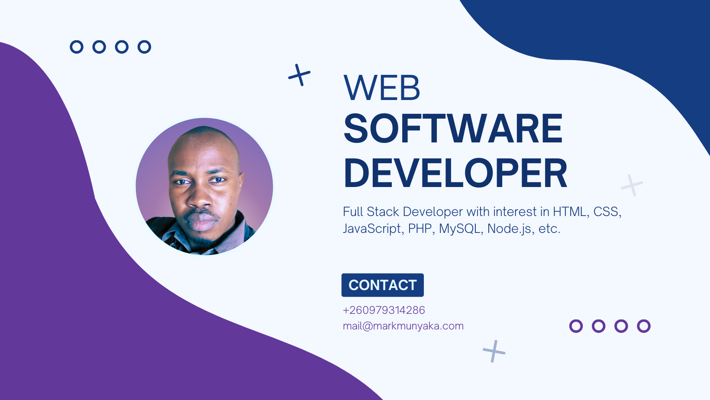

# Hi there 👋 I'm Mark Munyaka

I am a Web Developer and Technical Writer.

I specialize in the JAMstack and have worked with the following frameworks:
- Frontend: Next.js, Nuxt.js, Gatsby.js, Blazor WebAssembly, Jekyll, Hugo
- Backend: Strapi CMS, Medusajs, Directus CMS

## Here are some of my projects
- [Ecommerce App Built Using Next.js, Medusa and Stackbit](https://github.com/Marktawa/medusa-stackbit-app)
- Deployment of Medusa Server on [Google Cloud](https://dev.to/markmunyaka/deploy-a-medusa-server-on-google-cloud-for-free-3i3a) and [Oracle Cloud](https://dev.to/markmunyaka/deploying-medusa-to-oracle-cloud-501e)
- [Blog App Built Using Next.js and Strapi CMS](https://github.com/Marktawa/blog-strapi). 
- [Ecommerce App with i18n Built Using Gatsby.js and Strapi CMS](https://github.com/Marktawa/tags-strapi-bluedolphin)
- [Blog App Built Using Gatsbyjs and Strapi CMS](https://github.com/Marktawa/strapi-gatsby-blog)

